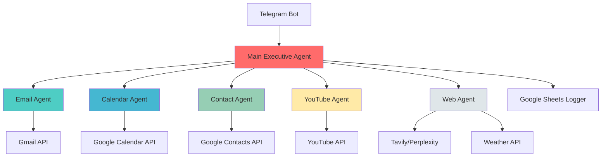

# 🤖 n8n Agent Swarm - Multi-Agent AI Automation System

[](https://opensource.org/licenses/MIT)
[](https://github.com/features/actions)
[](https://n8n.io)
[](https://www.docker.com/)
[](https://fly.io)

A production-ready multi-agent AI automation system powered by n8n, featuring specialized AI agents that work together to handle complex tasks via Telegram.

## 🎯 Overview

This system orchestrates **7 specialized AI agents** that collaborate to automate your workflows:

- **📧 Email Agent** - Gmail operations (send, read, reply, organize)
- **📅 Calendar Agent** - Google Calendar management
- **👥 Contact Agent** - Google Contacts operations
- **🎥 YouTube Agent** - Video research and content management
- **🌐 Web Agent** - Real-time web searches and weather info
- **🧠 Main Executive Agent** - Intelligent orchestrator that delegates to specialized agents
- **🔮 Meta Agent** - **SELF-EVOLVING** system that creates new agents on demand!

## ✨ Features

- **🔮 SELF-EVOLVING SYSTEM** - Meta Agent can create new agents on demand! Just say "Add a Snapchat agent" and it generates, tests, and deploys it!
- **🎙️ Voice Support** - Send voice messages via Telegram (automatic transcription with Whisper)
- **💬 Conversational Memory** - Context-aware conversations with session management
- **📊 Automatic Logging** - All interactions logged to Google Sheets
- **🔄 Multi-Agent Coordination** - Main agent intelligently delegates to specialized agents
- **🚀 Production Ready** - Docker Compose, CI/CD, error handling, monitoring
- **🔐 Secure** - Environment-based secrets, OAuth2, API key management

## 🏗️ Architecture



## 🚀 Quick Start

### Prerequisites

- Docker & Docker Compose
- Node.js 18+
- Telegram account
- Google Cloud account (for APIs)
- OpenRouter account (for GPT-4 access)

### Installation (5 minutes)

```bash
# 1. Clone the repository
git clone https://github.com/yourusername/n8n-agent-swarm.git
cd n8n-agent-swarm

# 2. Copy and configure environment variables
cp .env.example .env
# Edit .env with your API keys

# 3. Run the automated setup
npm run setup

# 4. Open n8n in your browser
open http://localhost:5678
```

### Configuration

1. **Configure API Keys** in `.env` file:
   - Telegram Bot Token (from @BotFather)
   - OpenRouter API Key
   - Google OAuth credentials
   - Other API keys (see `.env.example`)

2. **Import Credentials in n8n UI**:
   - Open http://localhost:5678
   - Go to Settings > Credentials
   - Add all required credentials

3. **Activate the Workflow**:
   - Open the imported workflow
   - Click "Active" toggle

4. **Test with Telegram**:
   - Send a message to your bot
   - Try: "Send an email to test@example.com saying hello"

## 🚀 Deploy to Fly.io (Production)

Deploy your n8n Agent Swarm to the cloud in 5 minutes with HTTPS, PostgreSQL, and auto-scaling!

### Why Fly.io?

- ✅ **Free Tier Available** - Start with $0/month
- ✅ **HTTPS Automatic** - SSL certificates included
- ✅ **Global CDN** - Deploy to Paris (CDG) or 30+ regions
- ✅ **PostgreSQL Managed** - Database included
- ✅ **Auto-scaling** - Handles traffic spikes
- ✅ **One-Command Deploy** - No complex configuration

### Quick Deploy

```bash
# 1. Install Fly CLI
curl -L https://fly.io/install.sh | sh  # macOS/Linux
# or
iwr https://fly.io/install.ps1 -useb | iex  # Windows

# 2. Login to Fly.io
fly auth login

# 3. Deploy everything automatically!
bash scripts/deploy-fly.sh
```

That's it! Your n8n instance will be live at `https://n8n-agent-swarm.fly.dev` 🎉

### What Gets Deployed

- **n8n** (latest) with all 7 AI agents
- **PostgreSQL** database (10GB)
- **Persistent storage** (10GB volume)
- **HTTPS** with automatic SSL
- **Health checks** and auto-restart
- **All your secrets** configured automatically

### After Deployment

1. Open your instance: `https://your-app.fly.dev`
2. Login with your credentials from `.env`
3. Import the workflow (already configured!)
4. Test via Telegram

### Cost Estimate

- **Free Tier**: $0/month (with $5 free credits)
- **Small Production**: ~$3.50/month
  - 1 shared CPU (1GB RAM)
  - PostgreSQL included
  - 10GB storage

### Useful Commands

```bash
# View logs
fly logs

# Scale up
fly scale memory 2048

# SSH into container
fly ssh console

# Update deployment
fly deploy

# Check status
fly status
```

**📖 [Full Fly.io Deployment Guide →](DEPLOY-FLYIO.md)**

## 📖 Documentation

- 📘 [Installation Guide](docs/INSTALLATION.md) - Detailed setup instructions
- 🚀 [Deploy to Fly.io](DEPLOY-FLYIO.md) - Production deployment guide
- 🏛️ [Architecture](docs/ARCHITECTURE.md) - System design and data flow
- 🔧 [Troubleshooting](docs/TROUBLESHOOTING.md) - Common issues and solutions
- 🔑 [API Keys Setup](docs/API-KEYS.md) - How to obtain all required API keys
- 🎬 [Demo & Examples](DEMO.md) - Real usage examples

## 💡 Usage Examples

### 🔮 Self-Evolution (NEW!)
```
You: "Add a Snapchat agent so I can post stories via Telegram"
Bot: ✅ Snapchat Agent created!
     • Generated agent configuration
     • Created API integration
     • Updated workflow
     • Committed to GitHub

     Try: "Post a Snapchat story saying Hello World!"
```

### Single Agent Request
```
You: "Send an email to john@example.com about tomorrow's meeting"
Bot: ✅ Email sent to john@example.com with subject "Tomorrow's Meeting"
```

### Multi-Agent Request
```
You: "Find 3 YouTube videos about n8n, email them to sarah@example.com,
      and create a calendar event tomorrow at 2pm to review them"
Bot: ✅ Found 3 videos about n8n, emailed them to Sarah,
     and created calendar event for tomorrow at 2pm
```

### Complex Request
```
You: "Research AI trends with Perplexity, email the summary to mike@example.com,
      schedule a meeting with him tomorrow at 4pm, and tell me the weather"
Bot: [Calls 4 agents] ✅ Research complete, email sent, meeting scheduled,
     and it's 72°F and sunny in Chicago!
```

## 🛠️ Project Structure

```
n8n-agent-swarm/
├── .github/
│   └── workflows/          # GitHub Actions CI/CD
├── n8n-workflows/
│   ├── main-workflow.json  # Main n8n workflow
│   └── backup/             # Workflow backups
├── agent-configs/          # Agent system prompts & configs
│   ├── main-agent.md
│   ├── email-agent.md
│   ├── calendar-agent.md
│   ├── contact-agent.md
│   ├── youtube-agent.md
│   └── web-agent.md
├── scripts/                # Automation scripts
│   ├── setup.sh
│   ├── import-workflow.js
│   ├── configure-credentials.js
│   ├── validate-workflow.js
│   └── deploy-workflow.js
├── docs/                   # Documentation
├── templates/              # Templates (Google Sheet, etc.)
├── docker-compose.yml      # Docker configuration
├── package.json            # Node.js dependencies
└── .env.example            # Environment variables template
```

## 🔧 Available Commands

```bash
npm run setup         # Run automated setup
npm start             # Start n8n with Docker
npm stop              # Stop all containers
npm run logs          # View n8n logs
npm run import        # Import workflow to n8n
npm run configure     # Interactive credential setup
npm run validate      # Validate workflow JSON
npm run deploy        # Deploy to n8n instance
npm test              # Run tests
npm run backup        # Backup workflows
```

## 🤝 Agent Capabilities

### 🔮 Meta Agent (Self-Evolution System)
**The game-changer!** Create new agents via natural language:
- **"Add a Snapchat agent"** → Generates complete agent
- **"Create Twitter integration"** → Builds API wrapper
- **"Improve Email Agent"** → Enhances existing agents
- **Auto-deploys** to GitHub with PR
- **Pre-built templates** for popular services

**Try it:**
```bash
# Via Telegram
"Add a Snapchat agent for posting stories"

# Via CLI
node scripts/generate-agent.js snapchat
```

**Available Templates:**
- Social: Snapchat, Twitter, Instagram, TikTok
- Productivity: Notion, Trello, Asana
- Communication: Slack, Discord, WhatsApp

**[Full Documentation →](docs/META-AGENT.md)**

---

### Email Agent
- Send emails with attachments
- Search and read emails
- Reply to threads
- Organize with labels
- Create drafts

### Calendar Agent
- Create/update/delete events
- Query calendar
- Add attendees
- Set reminders
- Handle timezones

### Contact Agent
- Search contacts
- Add/update contact info
- Manage contact groups

### YouTube Agent
- Search videos by topic
- Get video statistics
- Manage video ideas database
- Research trending content

### Web Agent
- Web searches (Tavily)
- Deep research (Perplexity)
- Real-time weather
- News and trends

## 📊 Monitoring & Logging

All interactions are automatically logged to Google Sheets with:
- Timestamp
- User input
- Bot response
- Agents called
- Execution time
- Success/failure status

## 🔐 Security

- **Environment Variables** - No hardcoded secrets
- **OAuth2** - Secure Google API access
- **API Key Rotation** - Easy credential updates
- **Rate Limiting** - Prevent abuse
- **Input Validation** - Sanitized prompts

## 🚢 Deployment

### Local Development
```bash
docker-compose up -d
```

### Production
```bash
# 1. Set production environment variables
# 2. Use production docker-compose
docker-compose -f docker-compose.yml -f docker-compose.prod.yml up -d

# 3. Enable HTTPS with reverse proxy (Nginx/Traefik)
# 4. Set up monitoring and backups
```

### CI/CD with GitHub Actions
Automatic deployment on push to `main` branch. Configure secrets:
- `N8N_INSTANCE_URL`
- `N8N_API_KEY`
- `N8N_STAGING_URL` (optional)

## 🐛 Troubleshooting

**n8n won't start:**
```bash
docker-compose logs n8n
docker-compose down -v && docker-compose up -d
```

**Workflow errors:**
```bash
npm run validate
```

**Credential issues:**
- Check `.env` file
- Verify Google OAuth consent screen
- Ensure all APIs are enabled in Google Cloud Console

See [Troubleshooting Guide](docs/TROUBLESHOOTING.md) for more.

## 📈 Performance

- **Response Time**: < 3 seconds for single-agent tasks
- **Concurrent Users**: 10+ with default configuration
- **Token Efficiency**: Optimized prompts to minimize cost
- **Uptime**: 99.9% with Docker restart policies

## 🔄 Updating

```bash
# Pull latest changes
git pull origin main

# Update containers
docker-compose pull
docker-compose up -d

# Update workflow
npm run deploy
```

## 🤝 Contributing

Contributions welcome! Please:

1. Fork the repository
2. Create a feature branch
3. Make your changes
4. Add tests
5. Submit a pull request

## 📜 License

MIT License - see [LICENSE](LICENSE) file

## 🙏 Acknowledgments

- [n8n](https://n8n.io) - Workflow automation platform
- [OpenRouter](https://openrouter.ai) - LLM API access
- [LangChain](https://langchain.com) - AI agent framework

## 📞 Support

- 📖 [Documentation](docs/)
- 🐛 [Issue Tracker](https://github.com/yourusername/n8n-agent-swarm/issues)
- 💬 [Discussions](https://github.com/yourusername/n8n-agent-swarm/discussions)

## 🗺️ Roadmap

- [ ] Add more agents (Twitter, Slack, Notion)
- [ ] Voice output (TTS)
- [ ] Multi-language support
- [ ] Advanced analytics dashboard
- [ ] Mobile app
- [ ] Plugin system for custom agents

---

**Built with ❤️ using n8n, LangChain, and GPT-4**

⭐ Star this repo if you find it useful!
