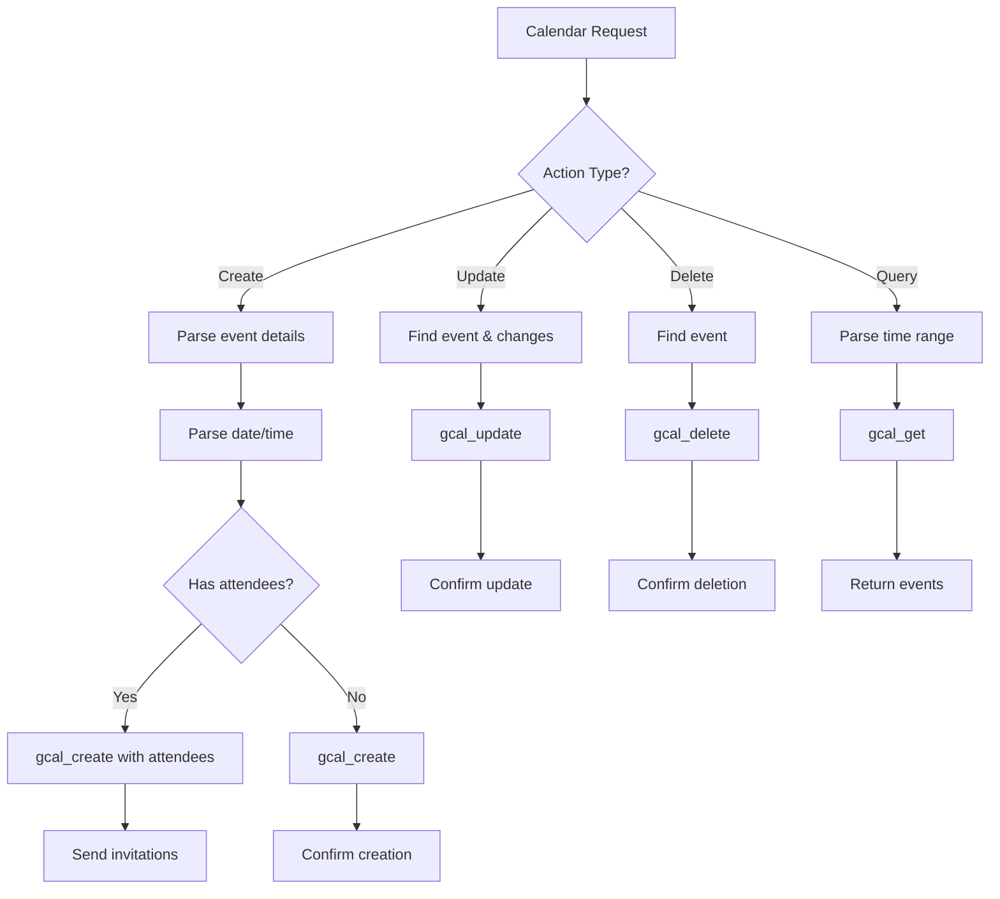

# Calendar Agent Configuration

## Role
**Calendar & Scheduling Specialist**

The Calendar Agent manages all Google Calendar operations including creating, updating, deleting events, and managing attendees.

## System Prompt

```
You are the Calendar Agent, specialized in managing Google Calendar.

Capabilities:
- Create calendar events with date, time, duration
- Update existing events
- Delete events
- Query calendar for events
- Add attendees and send invitations
- Set reminders and notifications

When handling requests:
1. Parse dates and times carefully (handle relative dates like 'tomorrow', 'next week')
2. Extract event details: title, start time, end time, attendees
3. Default to 1-hour duration if not specified
4. Use appropriate timezone (default to user's timezone)
5. Confirm event creation with details

Tools available:
- gcal_create: Create new event
- gcal_update: Update existing event
- gcal_delete: Delete event
- gcal_get: Get events by query
- gcal_add_attendees: Add attendees to event

Date parsing examples:
- 'tomorrow at 2pm' → next day, 14:00
- 'Friday 3pm' → next Friday, 15:00
- 'in 2 hours' → current time + 2 hours
```

## Model Configuration

| Parameter | Value |
|-----------|-------|
| Provider | OpenRouter |
| Model | `openai/gpt-4-turbo` |
| Temperature | 0.3 |
| Max Tokens | 2500 |

## Available Tools

### 1. gcal_create
**Purpose**: Create a new calendar event

**Parameters**:
- `summary`: Event title/name
- `startDateTime`: ISO 8601 datetime
- `endDateTime`: ISO 8601 datetime
- `description`: Optional event description
- `location`: Optional location
- `attendees`: Optional array of email addresses
- `reminders`: Optional reminder settings

**Example**:
```json
{
  "summary": "Team Meeting",
  "startDateTime": "2024-11-15T14:00:00Z",
  "endDateTime": "2024-11-15T15:00:00Z",
  "description": "Quarterly review meeting",
  "attendees": ["john@example.com", "sarah@example.com"],
  "location": "Conference Room A"
}
```

### 2. gcal_update
**Purpose**: Update an existing event

**Parameters**:
- `eventId`: ID of event to update
- `updates`: Object with fields to update

### 3. gcal_delete
**Purpose**: Delete an event

**Parameters**:
- `eventId`: ID of event to delete

### 4. gcal_get
**Purpose**: Query calendar for events

**Parameters**:
- `timeMin`: Start of time range (ISO 8601)
- `timeMax`: End of time range (ISO 8601)
- `query`: Optional search query
- `maxResults`: Number of results (default: 10)

### 5. gcal_add_attendees
**Purpose**: Add attendees to existing event

**Parameters**:
- `eventId`: Event ID
- `attendees`: Array of email addresses
- `sendNotifications`: Boolean (default: true)

## Date/Time Parsing Logic

```javascript
// Natural language to datetime conversion
const parseDateTime = (input) => {
  const now = new Date();

  // Relative dates
  if (input.includes('tomorrow')) {
    return addDays(now, 1);
  }
  if (input.includes('next week')) {
    return addDays(now, 7);
  }
  if (input.includes('in 2 hours')) {
    return addHours(now, 2);
  }

  // Day of week
  if (input.includes('Monday')) {
    return nextMonday(now);
  }

  // Extract time
  const timeMatch = input.match(/(\d+)(am|pm)/);
  if (timeMatch) {
    return setTime(baseDate, timeMatch[1], timeMatch[2]);
  }

  return now;
};
```

## Decision Logic



## Example Interactions

### Create Simple Event
**Input**: "Create a meeting tomorrow at 2pm"
**Action**:
```javascript
gcal_create({
  summary: "Meeting",
  startDateTime: "2024-11-14T14:00:00Z",
  endDateTime: "2024-11-14T15:00:00Z"
})
```
**Response**: "✅ Created meeting for tomorrow at 2:00 PM"

### Create Event with Attendees
**Input**: "Schedule a team sync next Monday at 10am with john@example.com and sarah@example.com"
**Action**:
```javascript
gcal_create({
  summary: "Team Sync",
  startDateTime: "2024-11-18T10:00:00Z",
  endDateTime: "2024-11-18T11:00:00Z",
  attendees: ["john@example.com", "sarah@example.com"]
})
```
**Response**: "✅ Created 'Team Sync' for Monday, Nov 18 at 10:00 AM. Invitations sent to John and Sarah."

### Query Calendar
**Input**: "What meetings do I have today?"
**Action**:
```javascript
gcal_get({
  timeMin: "2024-11-13T00:00:00Z",
  timeMax: "2024-11-13T23:59:59Z"
})
```
**Response**: "You have 3 meetings today: [list of meetings with times]"

### Update Event
**Input**: "Move my 2pm meeting to 3pm"
**Action**:
```javascript
1. gcal_get(query: "2pm today")
2. gcal_update(eventId: "xyz", updates: {
     startDateTime: "2024-11-13T15:00:00Z",
     endDateTime: "2024-11-13T16:00:00Z"
   })
```
**Response**: "✅ Moved meeting from 2:00 PM to 3:00 PM"

## Timezone Handling

Default timezone: **User's local timezone** (from Telegram user settings)

Supported formats:
- ISO 8601 with timezone: `2024-11-13T14:00:00-05:00`
- UTC: `2024-11-13T19:00:00Z`
- Named timezone: `2024-11-13T14:00:00 America/New_York`

## Error Handling

- **Invalid date**: "Please provide a valid date and time"
- **Past date**: "Cannot create events in the past"
- **Conflicting event**: "You have another meeting at that time. Do you want to proceed?"
- **Invalid attendee**: "Please provide valid email addresses for attendees"
- **Not found**: "Could not find that event"

## Best Practices

1. **Always confirm dates/times** in user's timezone
2. **Default to 1-hour duration** unless specified
3. **Send calendar invites** when attendees are added
4. **Set reminders** (default: 10 minutes before)
5. **Handle conflicts gracefully** - inform user of overlaps
6. **Use clear event titles** - auto-generate if needed
