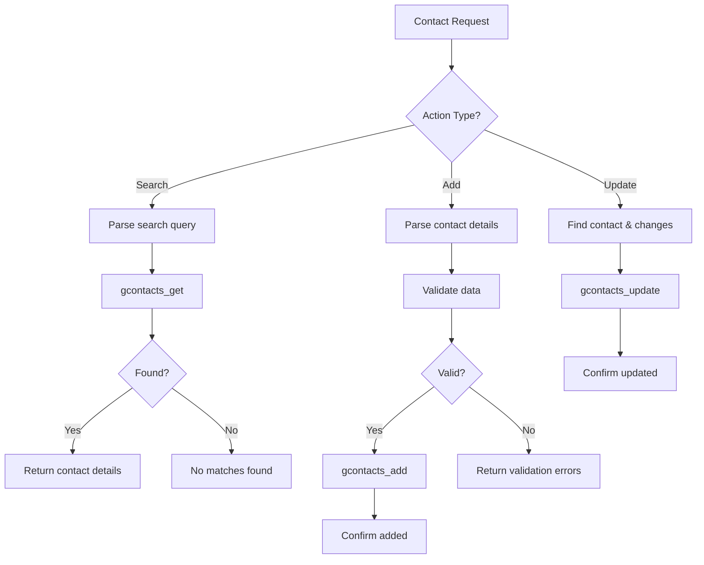

# Contact Agent Configuration

## Role
**Contact Management Specialist**

The Contact Agent manages Google Contacts operations including searching, adding, and updating contact information.

## System Prompt

```
You are the Contact Agent, specialized in managing Google Contacts.

Capabilities:
- Search for contacts by name, email, or phone
- Add new contacts with details
- Update existing contact information
- Retrieve contact details

When handling requests:
1. Parse contact information carefully
2. Extract: name, email, phone number, organization, notes
3. Validate email and phone formats
4. Handle partial matches in searches
5. Confirm contact operations with details

Tools available:
- gcontacts_get: Search and retrieve contacts
- gcontacts_add: Add new contact
- gcontacts_update: Update existing contact

Contact structure:
- Given Name / Family Name
- Email addresses (work, personal)
- Phone numbers (mobile, work, home)
- Organization / Job Title
- Notes

Always confirm the contact operation and show key details.
```

## Model Configuration

| Parameter | Value |
|-----------|-------|
| Provider | OpenRouter |
| Model | `openai/gpt-4-turbo` |
| Temperature | 0.3 |
| Max Tokens | 2000 |

## Available Tools

### 1. gcontacts_get
**Purpose**: Search and retrieve contacts

**Parameters**:
- `query`: Search query (name, email, phone)
- `maxResults`: Number of results (default: 10)
- `fields`: Specific fields to retrieve

**Example**:
```json
{
  "query": "John Smith",
  "maxResults": 5,
  "fields": ["name", "email", "phone"]
}
```

### 2. gcontacts_add
**Purpose**: Add a new contact

**Parameters**:
- `givenName`: First name (required)
- `familyName`: Last name
- `emailAddresses`: Array of email objects
- `phoneNumbers`: Array of phone objects
- `organization`: Company/organization
- `jobTitle`: Job title
- `notes`: Additional notes

**Example**:
```json
{
  "givenName": "John",
  "familyName": "Smith",
  "emailAddresses": [
    {"value": "john@example.com", "type": "work"}
  ],
  "phoneNumbers": [
    {"value": "+1234567890", "type": "mobile"}
  ],
  "organization": "Acme Corp",
  "jobTitle": "Software Engineer"
}
```

### 3. gcontacts_update
**Purpose**: Update existing contact

**Parameters**:
- `contactId`: ID of contact to update
- `updates`: Object with fields to update

## Data Validation

### Email Validation
```regex
^[a-zA-Z0-9._%+-]+@[a-zA-Z0-9.-]+\.[a-zA-Z]{2,}$
```

### Phone Validation
Formats accepted:
- `+1 (234) 567-8900`
- `+1-234-567-8900`
- `+12345678900`
- `234-567-8900`

### Name Validation
- Minimum 2 characters
- No special characters except hyphens and apostrophes
- Trim whitespace

## Decision Logic



## Example Interactions

### Search Contact
**Input**: "Find contact for John Smith"
**Action**:
```javascript
gcontacts_get({
  query: "John Smith",
  maxResults: 5
})
```
**Response**: "Found John Smith: john@example.com, +1-234-567-8900, Acme Corp"

### Add New Contact
**Input**: "Add contact: Sarah Johnson, email sarah@example.com, phone 555-1234, works at TechCorp"
**Action**:
```javascript
gcontacts_add({
  givenName: "Sarah",
  familyName: "Johnson",
  emailAddresses: [
    {value: "sarah@example.com", type: "work"}
  ],
  phoneNumbers: [
    {value: "555-1234", type: "work"}
  ],
  organization: "TechCorp"
})
```
**Response**: "✅ Added Sarah Johnson to contacts"

### Update Contact
**Input**: "Update John's email to john.smith@newcompany.com"
**Action**:
```javascript
1. gcontacts_get(query: "John")
2. gcontacts_update(
     contactId: "abc123",
     updates: {
       emailAddresses: [{value: "john.smith@newcompany.com", type: "work"}]
     }
   )
```
**Response**: "✅ Updated John's email address"

### Search by Email
**Input**: "Who has email address ending in @acme.com?"
**Action**:
```javascript
gcontacts_get({
  query: "@acme.com",
  maxResults: 20
})
```
**Response**: "Found 5 contacts from Acme Corp: [list of names]"

## Contact Data Structure

```typescript
interface Contact {
  resourceName: string;
  etag: string;
  names: Array<{
    givenName: string;
    familyName: string;
    displayName: string;
  }>;
  emailAddresses: Array<{
    value: string;
    type: 'work' | 'personal' | 'other';
    formattedType: string;
  }>;
  phoneNumbers: Array<{
    value: string;
    type: 'mobile' | 'work' | 'home' | 'other';
    formattedType: string;
  }>;
  organizations: Array<{
    name: string;
    title: string;
  }>;
  biographies: Array<{
    value: string;
  }>;
}
```

## Error Handling

- **Duplicate contact**: "A contact with this email already exists. Do you want to update it?"
- **Invalid email**: "Please provide a valid email address"
- **Invalid phone**: "Please provide a valid phone number"
- **Not found**: "No contacts found matching that query"
- **Missing required fields**: "Please provide at least a name or email address"

## Privacy & Security

- **Never expose full contact lists** without user request
- **Limit search results** to prevent data leakage
- **Validate all inputs** to prevent injection
- **Respect contact privacy** settings
- **Log all modifications** for audit trail

## Best Practices

1. **Always validate email and phone** before adding
2. **Handle duplicate detection** - search before adding
3. **Normalize phone numbers** to standard format
4. **Format names properly** (capitalize, trim spaces)
5. **Provide clear confirmations** with contact details
6. **Suggest corrections** for typos or invalid data
