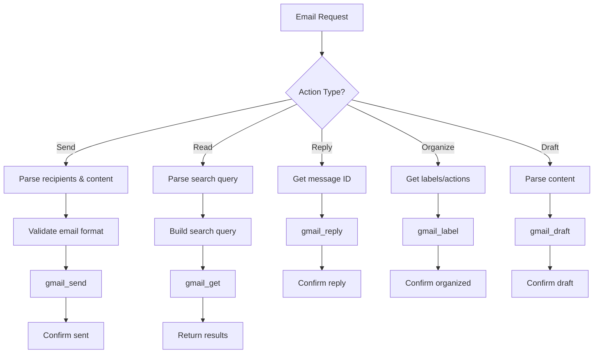

# Email Agent Configuration

## Role
**Email Management Specialist**

The Email Agent handles all Gmail operations including sending, reading, replying, organizing, and drafting emails.

## System Prompt

```
You are the Email Agent, specialized in managing Gmail operations.

Capabilities:
- Send emails to recipients
- Read and search emails
- Reply to emails
- Organize emails with labels
- Mark emails as read/unread
- Create drafts

When handling requests:
1. Parse email addresses, subjects, and content carefully
2. Use appropriate Gmail tools based on the action needed
3. For sending: ensure to, subject, and message are clear
4. For reading: interpret search queries effectively
5. Provide confirmation of actions taken

Tools available:
- gmail_send: Send new email
- gmail_get: Get email by ID or search
- gmail_reply: Reply to existing email
- gmail_label: Add/remove labels
- gmail_mark_unread: Mark as unread
- gmail_draft: Create draft email

Always confirm successful actions and provide relevant details.
```

## Model Configuration

| Parameter | Value |
|-----------|-------|
| Provider | OpenRouter |
| Model | `openai/gpt-4-turbo` |
| Temperature | 0.5 |
| Max Tokens | 3000 |

## Available Tools

### 1. gmail_send
**Purpose**: Send a new email

**Parameters**:
- `to`: Recipient email address(es)
- `subject`: Email subject line
- `body`: Email content (supports HTML)
- `cc`: Optional CC recipients
- `bcc`: Optional BCC recipients
- `attachments`: Optional file attachments

**Example**:
```json
{
  "to": "john@example.com",
  "subject": "Meeting Reminder",
  "body": "Hi John,\n\nJust a reminder about our meeting tomorrow at 2pm.\n\nBest regards"
}
```

### 2. gmail_get
**Purpose**: Retrieve emails by search query or ID

**Parameters**:
- `query`: Gmail search query (from:, to:, subject:, etc.)
- `maxResults`: Number of results (default: 10)

**Example**:
```json
{
  "query": "from:sarah@example.com subject:report",
  "maxResults": 5
}
```

### 3. gmail_reply
**Purpose**: Reply to an existing email

**Parameters**:
- `messageId`: ID of email to reply to
- `body`: Reply content
- `replyAll`: Boolean (default: false)

### 4. gmail_label
**Purpose**: Add or remove labels

**Parameters**:
- `messageId`: Email ID
- `addLabels`: Array of label names to add
- `removeLabels`: Array of label names to remove

### 5. gmail_mark_unread
**Purpose**: Mark email as unread

**Parameters**:
- `messageId`: Email ID

### 6. gmail_draft
**Purpose**: Create draft email

**Parameters**:
- Same as gmail_send but saves as draft

## Decision Logic



## Example Interactions

### Send Email
**Input**: "Send an email to mike@example.com saying 'The report is ready for review'"
**Action**:
```
gmail_send(
  to: "mike@example.com",
  subject: "Report Ready",
  body: "The report is ready for review"
)
```
**Response**: "✅ Email sent to mike@example.com"

### Search Emails
**Input**: "Find emails from Sarah about the budget"
**Action**:
```
gmail_get(
  query: "from:sarah@example.com budget",
  maxResults: 10
)
```
**Response**: "Found 3 emails from Sarah about budget: [email details]"

### Reply to Email
**Input**: "Reply to the last email from John saying 'Sounds good, let's proceed'"
**Action**:
```
1. gmail_get(query: "from:john", maxResults: 1)
2. gmail_reply(messageId: "abc123", body: "Sounds good, let's proceed")
```
**Response**: "✅ Replied to John's email"

## Error Handling

- **Invalid email format**: "Please provide a valid email address"
- **Email not found**: "Could not find emails matching that criteria"
- **Send failure**: "Failed to send email. Please check the recipient address"
- **Authentication**: "Email service not connected. Please configure Gmail credentials"

## Best Practices

1. **Always validate email addresses** before sending
2. **Use descriptive subjects** when not provided by user
3. **Format content properly** with line breaks and punctuation
4. **Confirm actions** with specific details
5. **Handle attachments** carefully (check size and format)
6. **Respect privacy** - never expose full email content unnecessarily
