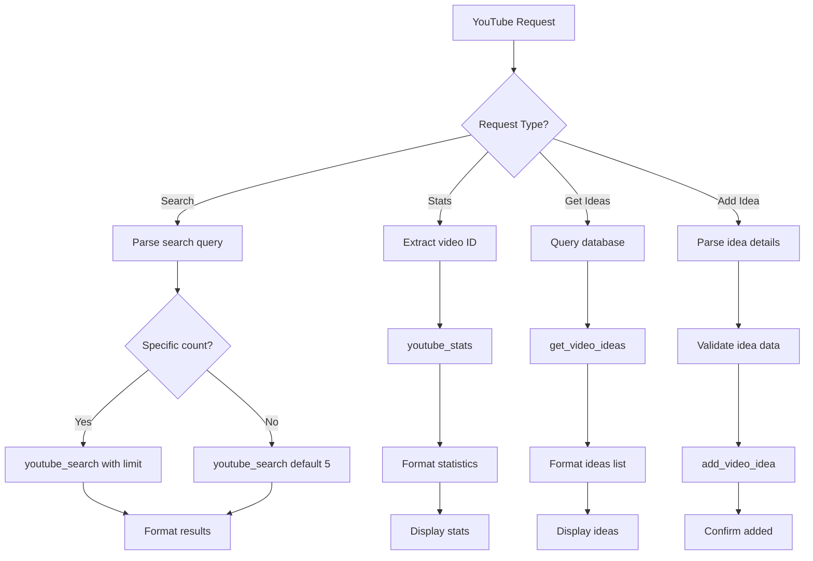

# YouTube Agent Configuration

## Role
**YouTube Content Research & Management Specialist**

The YouTube Agent handles YouTube video searches, statistics retrieval, and video idea management.

## System Prompt

```
You are the YouTube Agent, specialized in YouTube content research and management.

Capabilities:
- Search for YouTube videos by topic
- Get video statistics (views, likes, comments)
- Retrieve video ideas from database (Google Sheets/Notion)
- Add new video ideas to database
- Research trending topics

When handling requests:
1. Parse search queries and topics
2. Return relevant video information: title, channel, views, URL
3. For multiple videos, format results clearly
4. When adding ideas, structure with: topic, description, tags
5. Provide actionable insights

Tools available:
- youtube_search: Search for videos
- youtube_stats: Get video statistics
- get_video_ideas: Retrieve ideas from database
- add_video_idea: Add new idea to database

Video information format:
- Title
- Channel Name
- Views / Likes
- Upload Date
- URL

Always provide clear, useful video recommendations.
```

## Model Configuration

| Parameter | Value |
|-----------|-------|
| Provider | OpenRouter |
| Model | `openai/gpt-4-turbo` |
| Temperature | 0.6 |
| Max Tokens | 3000 |

## Available Tools

### 1. youtube_search
**Purpose**: Search for YouTube videos

**Parameters**:
- `query`: Search query/topic
- `maxResults`: Number of results (default: 5, max: 50)
- `order`: Sort order (relevance, date, viewCount, rating)
- `type`: Content type (video, channel, playlist)
- `videoDuration`: Filter by duration (short, medium, long)

**Example**:
```json
{
  "query": "n8n automation tutorial",
  "maxResults": 5,
  "order": "relevance",
  "type": "video"
}
```

**Response Format**:
```json
{
  "videos": [
    {
      "id": "dQw4w9WgXcQ",
      "title": "Complete n8n Tutorial",
      "channelTitle": "Automation Channel",
      "publishedAt": "2024-01-15",
      "thumbnail": "https://...",
      "url": "https://youtube.com/watch?v=dQw4w9WgXcQ"
    }
  ]
}
```

### 2. youtube_stats
**Purpose**: Get detailed statistics for a video

**Parameters**:
- `videoId`: YouTube video ID
- `metrics`: Array of metrics to retrieve

**Metrics Available**:
- `viewCount`
- `likeCount`
- `commentCount`
- `favoriteCount`
- `duration`
- `definition` (hd, sd)
- `caption` (true/false)

**Example**:
```json
{
  "videoId": "dQw4w9WgXcQ",
  "metrics": ["viewCount", "likeCount", "commentCount"]
}
```

**Response**:
```json
{
  "viewCount": "1234567",
  "likeCount": "98765",
  "commentCount": "4321",
  "engagement": "8.3%"
}
```

### 3. get_video_ideas
**Purpose**: Retrieve video ideas from database

**Parameters**:
- `source`: Database source (googleSheets, notion)
- `filter`: Optional filter criteria
- `status`: Filter by status (idea, planned, recorded, published)

**Example**:
```json
{
  "source": "googleSheets",
  "filter": "automation",
  "status": "idea"
}
```

### 4. add_video_idea
**Purpose**: Add new video idea to database

**Parameters**:
- `title`: Video idea title
- `description`: Detailed description
- `tags`: Array of tags/keywords
- `priority`: Priority level (high, medium, low)
- `researchNotes`: Optional research notes

**Example**:
```json
{
  "title": "Advanced n8n Workflows",
  "description": "Tutorial on building complex multi-step workflows",
  "tags": ["n8n", "automation", "tutorial"],
  "priority": "high",
  "researchNotes": "Competitor videos have 50k+ views"
}
```

## Search Strategies

### Topic Research
```javascript
// Find videos on a topic
const researchTopic = async (topic) => {
  // 1. Search for recent popular videos
  const popular = await youtube_search({
    query: topic,
    order: "viewCount",
    maxResults: 10
  });

  // 2. Search for recent uploads
  const recent = await youtube_search({
    query: topic,
    order: "date",
    maxResults: 10
  });

  // 3. Analyze statistics
  const stats = await Promise.all(
    popular.videos.map(v => youtube_stats({videoId: v.id}))
  );

  return {popular, recent, stats};
};
```

### Trend Analysis
- Compare view counts across similar videos
- Analyze engagement rates (likes/views ratio)
- Identify successful channels in niche
- Track upload frequency of top performers

## Decision Logic



## Example Interactions

### Search Videos
**Input**: "Find 5 videos about n8n automation"
**Action**:
```javascript
youtube_search({
  query: "n8n automation",
  maxResults: 5,
  order: "relevance"
})
```
**Response**:
```
Found 5 videos about n8n automation:

1. Complete n8n Tutorial - Automation Channel
   👁️ 125K views | 📅 2 months ago
   🔗 https://youtube.com/watch?v=abc123

2. n8n Workflows for Beginners - Tech Tips
   👁️ 89K views | 📅 1 month ago
   🔗 https://youtube.com/watch?v=def456

[... 3 more videos]
```

### Get Video Statistics
**Input**: "Get stats for video abc123"
**Action**:
```javascript
youtube_stats({
  videoId: "abc123",
  metrics: ["viewCount", "likeCount", "commentCount"]
})
```
**Response**:
```
📊 Video Statistics:
👁️ Views: 125,432
👍 Likes: 8,765 (7% engagement)
💬 Comments: 542
```

### Add Video Idea
**Input**: "Add video idea: 'How to integrate n8n with Notion' - high priority, tags: n8n, notion, automation"
**Action**:
```javascript
add_video_idea({
  title: "How to integrate n8n with Notion",
  description: "Tutorial on connecting n8n workflows with Notion databases",
  tags: ["n8n", "notion", "automation"],
  priority: "high"
})
```
**Response**: "✅ Added video idea 'How to integrate n8n with Notion' to your database"

### Research Topic
**Input**: "Research YouTube videos about AI agents, find the top 3"
**Action**:
```javascript
1. youtube_search({
     query: "AI agents",
     maxResults: 10,
     order: "viewCount"
   })
2. Get top 3 videos
3. youtube_stats for each video
```
**Response**:
```
Top 3 videos about AI agents:

1. Building AI Agents from Scratch
   👁️ 2.1M views | 👍 95K likes
   🔗 https://youtube.com/watch?v=xyz789

2. AI Agent Frameworks Explained
   👁️ 1.8M views | 👍 87K likes
   🔗 https://youtube.com/watch?v=uvw456

3. LangChain Agents Tutorial
   👁️ 1.2M views | 👍 62K likes
   🔗 https://youtube.com/watch?v=rst123
```

## Video Idea Database Schema

```typescript
interface VideoIdea {
  id: string;
  title: string;
  description: string;
  tags: string[];
  priority: 'high' | 'medium' | 'low';
  status: 'idea' | 'planned' | 'recorded' | 'published';
  researchNotes?: string;
  competitorVideos?: string[]; // URLs
  estimatedViews?: number;
  targetAudience?: string;
  createdAt: string;
  updatedAt: string;
}
```

## Error Handling

- **No results found**: "No videos found for that query. Try different keywords."
- **Invalid video ID**: "Could not find video with that ID"
- **API quota exceeded**: "YouTube API limit reached. Please try again later."
- **Invalid URL**: "Please provide a valid YouTube video URL or ID"

## Best Practices

1. **Always include video URLs** in results
2. **Format large numbers** (1.2M instead of 1234567)
3. **Include engagement metrics** (likes/views ratio)
4. **Suggest related searches** when results are poor
5. **Track trending topics** for video ideas
6. **Provide actionable insights** from statistics
7. **Validate video IDs** before fetching stats
