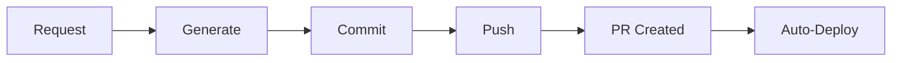

# 🧠 Meta Agent - Self-Evolving System Guide

## Overview

The **Meta Agent** is a revolutionary feature that allows the n8n Agent Swarm to **modify itself**. You can request new agents, features, and integrations via Telegram, and the system will generate, test, and deploy them automatically.

## 🎯 What Can the Meta Agent Do?

### 1. **Create New Agents**
Add entirely new specialized agents to your system:
```
"Add a Snapchat agent to post stories"
"Create a Twitter agent for tweeting"
"Build a Notion agent to manage my workspace"
```

### 2. **Generate Integrations**
Create API integrations for new services:
```
"Integrate with Spotify to control music"
"Add Discord bot capabilities"
"Connect to Shopify for e-commerce"
```

### 3. **Modify Existing Agents**
Improve or extend current agents:
```
"Make the Email Agent better at drafting professional emails"
"Add attachment support to the Email Agent"
"Enhance the Web Agent with image search"
```

### 4. **Deploy Changes**
Automatically commit and deploy modifications:
```
"Deploy the new Snapchat agent"
"Push changes to GitHub"
"Create a pull request for review"
```

## 🚀 Quick Start Examples

### Example 1: Add Snapchat Agent

**You say:**
```
"Add a Snapchat agent so I can post stories via Telegram"
```

**Meta Agent does:**
1. ✅ Generates `snapchat-agent.md` configuration
2. ✅ Creates API integration code
3. ✅ Updates n8n workflow JSON
4. ✅ Generates documentation
5. ✅ Commits to GitHub branch
6. ✅ Creates pull request

**Response:**
```
✅ Snapchat Agent created successfully!

New capabilities:
• Post stories to Snapchat
• Send snaps to friends
• View incoming snaps

Files created:
• agent-configs/snapchat-agent.md
• docs/agents/SNAPCHAT.md

GitHub:
• Branch: feature/snapchat-agent
• PR: #12

Next:
1. Add Snapchat API credentials
2. Merge the PR
3. Try: "Post a Snapchat story saying Hello!"
```

### Example 2: Add Twitter Integration

**You say:**
```
"Create a Twitter agent that can tweet and read my timeline"
```

**Meta Agent generates:**
- Complete Twitter agent configuration
- Twitter API wrapper code
- Documentation with examples
- Updated workflow with Twitter node

**You can then use:**
```
"Tweet: Just added AI automation to my Twitter! 🤖"
"Show me my latest 10 tweets"
"Reply to my last mention"
```

### Example 3: Improve Existing Agent

**You say:**
```
"Make the Email Agent smarter at writing professional emails"
```

**Meta Agent:**
1. Updates Email Agent system prompt
2. Adds professional email templates
3. Enhances context understanding
4. Commits improvements

## 🛠️ How It Works

### Architecture

```
Telegram Request
       ↓
Main Executive Agent
       ↓
Meta Agent (analyzes request)
       ↓
┌──────────────────────────────┐
│  1. Generate Agent Config    │
│  2. Create API Code          │
│  3. Update Workflow          │
│  4. Generate Docs            │
│  5. Run Tests                │
│  6. Commit to GitHub         │
│  7. Create PR (optional)     │
└──────────────────────────────┘
       ↓
Response to User
```

### File Generation

When you request a new agent, the Meta Agent creates:

```
n8n-agent-swarm/
├── agent-configs/
│   └── {new-agent}.md          ← Agent configuration
├── n8n-workflows/
│   └── main-workflow.json      ← Updated workflow
├── scripts/integrations/
│   └── {service}-api.js        ← API wrapper
├── docs/agents/
│   └── {SERVICE}.md            ← Documentation
└── tests/
    └── {service}-test.js       ← Integration tests
```

## 📝 Command Examples

### Creating Agents

```bash
# Social Media
"Add Instagram agent for posting photos"
"Create TikTok agent for video uploads"
"Build LinkedIn agent for professional networking"

# Productivity
"Add Trello agent for task management"
"Create Asana agent for project tracking"
"Build Jira agent for issue management"

# Communication
"Add Slack agent for team messaging"
"Create Discord agent for server management"
"Build WhatsApp agent for messaging"

# Content
"Add Medium agent for publishing articles"
"Create Substack agent for newsletters"
"Build WordPress agent for blog posting"

# E-commerce
"Add Shopify agent for store management"
"Create WooCommerce agent for orders"
"Build Stripe agent for payments"

# Development
"Add GitHub agent for repository management"
"Create GitLab agent for CI/CD"
"Build Jenkins agent for builds"
```

### Modifying Agents

```bash
"Improve Email Agent's subject line generation"
"Add voice message support to all agents"
"Enhance Web Agent with image search capabilities"
"Make Calendar Agent smarter at time zone handling"
```

### System Evolution

```bash
"Add batch processing for handling multiple requests"
"Optimize workflow for faster response times"
"Add caching layer for frequently accessed data"
"Implement queue system for high-traffic periods"
```

## 🔧 Manual Agent Generation

You can also use the command-line tool:

```bash
# Generate from template
cd n8n-agent-swarm
node scripts/generate-agent.js snapchat

# Available templates
node scripts/generate-agent.js
```

**Output:**
```
🤖 Generating Snapchat Agent...
✅ Agent configuration created: agent-configs/snapchat-agent.md

Next steps:
1. Review the generated configuration
2. Add API integration code if needed
3. Update n8n workflow to include this agent
4. Configure API credentials
5. Test the agent
```

## 🧪 Testing New Agents

After generating an agent:

```bash
# Validate configuration
npm run validate

# Test agent integration
npm test

# Import to n8n
npm run import-workflow
```

## 🔐 Security Considerations

### API Credentials

New agents require API credentials:

1. **Add to `.env`:**
```bash
SNAPCHAT_USERNAME=your_username
SNAPCHAT_PASSWORD=your_password  # Use app-specific password
# OR
SNAPCHAT_API_TOKEN=your_token
```

2. **Configure in n8n:**
   - Settings > Credentials
   - Add new credential
   - Select service type
   - Enter credentials

### Permission Scopes

Each agent requests minimal permissions:
- **Snapchat**: Post stories, send snaps (no read messages)
- **Twitter**: Tweet, read timeline (no DM access)
- **Notion**: Read/write pages (no admin access)

## 📚 Agent Templates

### Available Templates

1. **Social Media**: Snapchat, Twitter, Instagram, TikTok
2. **Productivity**: Notion, Trello, Asana, Todoist
3. **Communication**: Slack, Discord, WhatsApp, Teams
4. **Development**: GitHub, GitLab, Bitbucket
5. **E-commerce**: Shopify, WooCommerce, Stripe

### Custom Templates

Create your own template:

```javascript
const myServiceTemplate = {
  name: 'MyService',
  role: 'MyService Management Specialist',
  domain: 'MyService operations',
  capabilities: [
    'Do thing 1',
    'Do thing 2'
  ],
  tools: [
    {
      name: 'myservice_action',
      description: 'Perform action',
      parameters: {...},
      example: {...}
    }
  ],
  //... rest of config
};
```

## 🚢 Deployment Workflow

### Automatic Deployment

When Meta Agent creates a new agent:



### Manual Review (Recommended)

```bash
# 1. Meta Agent creates branch
feature/add-snapchat-agent

# 2. Review changes
git checkout feature/add-snapchat-agent
git diff main

# 3. Test locally
npm test

# 4. Merge when ready
git checkout main
git merge feature/add-snapchat-agent

# 5. Deploy
npm run deploy
```

## 🎓 Best Practices

1. **Start Simple**: Request basic agent first, enhance later
2. **Test Thoroughly**: Always test new agents before production use
3. **Review Code**: Check generated code for security issues
4. **Version Control**: Use branches for new agents
5. **Document**: The Meta Agent generates docs, but add your notes
6. **Rate Limits**: Be aware of API rate limits for new services
7. **Credentials**: Store credentials securely in environment variables

## 🐛 Troubleshooting

### Agent Generation Fails

```bash
# Check logs
npm run logs

# Validate workflow
npm run validate

# Check GitHub connection
git status
```

### API Integration Issues

```bash
# Test API credentials
node scripts/test-api.js snapchat

# Check API limits
# Review service's API documentation
```

### Deployment Issues

```bash
# Check GitHub Actions
# Go to Actions tab in GitHub

# Manual deployment
npm run deploy
```

## 🔮 Future Capabilities

The Meta Agent will soon support:

- **Voice agents**: Twilio, Vonage for phone calls
- **AI models**: Switch between GPT-4, Claude, Gemini
- **Custom workflows**: Generate entire workflows from description
- **Auto-optimization**: Analyze usage and optimize automatically
- **Multi-agent coordination**: Create agent teams for complex tasks

## 📖 Related Documentation

- [Agent Configuration Guide](../agent-configs/meta-agent.md)
- [Workflow Structure](ARCHITECTURE.md)
- [API Integration](API-KEYS.md)
- [Deployment Guide](INSTALLATION.md)

---

**The Meta Agent makes your automation system truly intelligent and self-evolving! 🧠✨**

Try it now:
```
"Add a Snapchat agent to my system"
```
